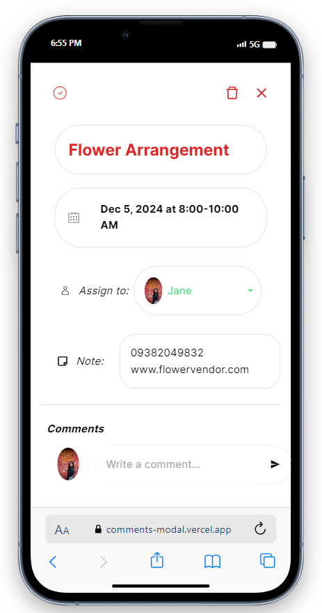

# Comments Modal (Mobile Friendly)

## Snapshots of the application

## Tech stack

## Local Setup
1) Clone the project using the command `git clone https://github.com/saikiran76/CommentsModal.git`
2) cd into the project: `cd CommentsModal`
3) Install the required dependencies using: `npm install`
4) Start and run the project on local host: `npm start`

